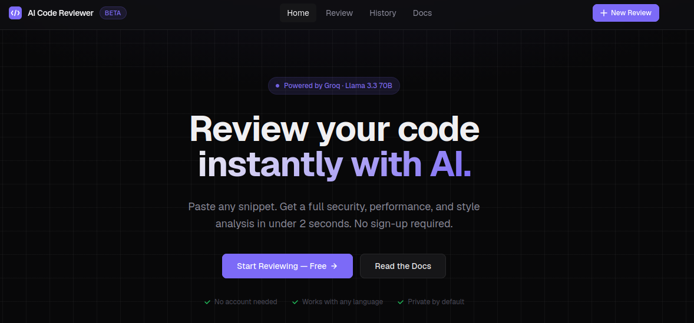
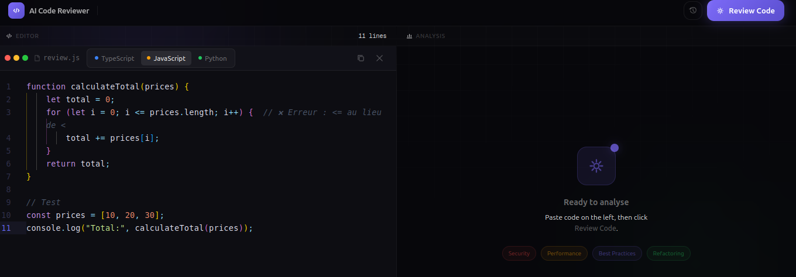
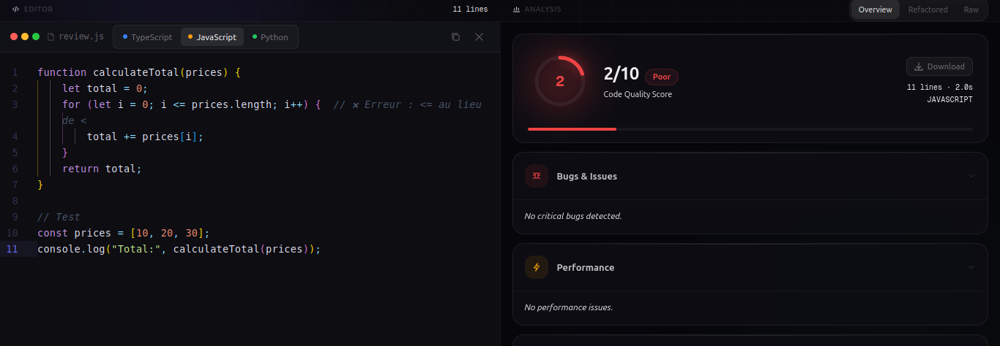
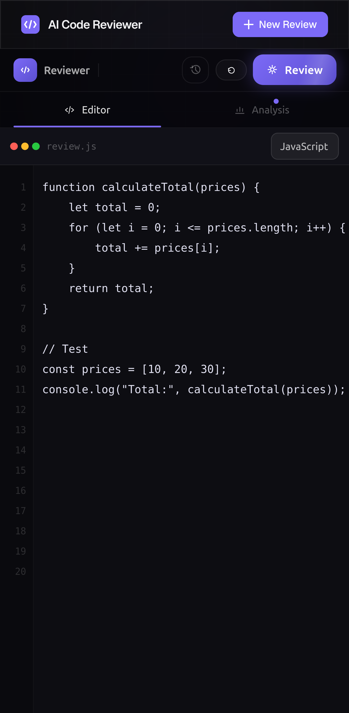
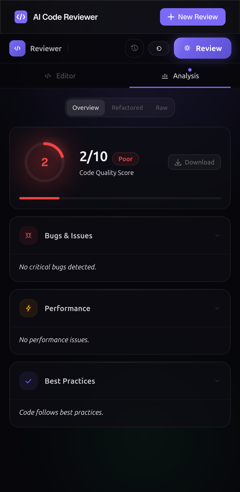

<div align="center">

# 🔍 AI Code Reviewer

**Analyse instantanée de code par intelligence artificielle.**  
Détecte les bugs, vulnérabilités et problèmes de performance en moins de 2 secondes.

[](https://nextjs.org)
[](https://typescriptlang.org)
[](https://tailwindcss.com)
[](https://groq.com)

[**Démo live**](https://ai-code-correction.vercel.app) · [**Rapport de bug**](https://github.com/Seraphin-26/ai-code-reviewer/issues)

</div>

## Screenshots

### Desktop View





### Mobile View




---

## ✨ Fonctionnalités

- 🤖 **Analyse IA** — Score qualité /10, bugs, sécurité (OWASP), performance, bonnes pratiques
- 💻 **Monaco Editor** — Le même éditeur que VS Code, avec coloration syntaxique
- 🔄 **Code refactorisé** — Version corrigée avec numéros de ligne et mise en évidence
- 🕐 **Historique** — 20 dernières analyses sauvegardées localement (localStorage)
- ⬇️ **Export** — Téléchargement du rapport complet en `.txt`
- 📋 **Copy** — Copie le code refactorisé en un clic
- 🔔 **Notifications** — Toasts animés pour chaque action
- 📱 **Responsive** — Split-screen sur desktop, onglets sur mobile

---

## 🚀 Démarrage rapide

### Prérequis

- Node.js 18+
- Une clé API Groq (gratuite sur [console.groq.com](https://console.groq.com/keys))

### Installation

```bash
# 1. Cloner le repo
git clone https://github.com/ton-username/ai-code-reviewer.git
cd ai-code-reviewer

# 2. Installer les dépendances
npm install

# 3. Configurer l'environnement
cp .env.example .env.local
```

Édite `.env.local` et ajoute ta clé :

```env
GROQ_API_KEY=gsk_xxxxxxxxxxxxxxxxxxxxxxxx
```

```bash
# 4. Lancer en développement
npm run dev
```

Ouvre [http://localhost:3000](http://localhost:3000) 🎉

---

## 🗂️ Structure du projet

```
ai-code-reviewer/
├── app/
│   ├── api/
│   │   └── review/
│   │       └── route.ts          # POST /api/review → Groq
│   ├── docs/
│   │   └── page.tsx              # Documentation
│   ├── history/
│   │   └── page.tsx              # Historique des reviews
│   ├── review/
│   │   └── page.tsx              # Page de review principale
│   ├── globals.css               # Design tokens + Tailwind
│   ├── layout.tsx                # Layout racine + Navbar
│   ├── not-found.tsx             # Page 404
│   └── page.tsx                  # Landing page
├── components/
│   └── ui/
│       ├── ActionButtons.tsx     # CopyButton + DownloadButton
│       ├── CodeEditor.tsx        # Wrapper Monaco Editor
│       ├── CodeReviewPanel.tsx   # Panneau principal (split-screen)
│       ├── HistoryPanel.tsx      # Drawer historique
│       ├── Navbar.tsx            # Navigation
│       ├── Toast.tsx             # Système de notifications
│       └── useReviewHistory.ts   # Hook localStorage
├── lib/
│   ├── types.ts                  # Types TypeScript partagés
│   └── utils.ts                  # Utilitaires (cn, formatDuration)
├── .env.example
├── next.config.mjs
├── tailwind.config.ts
├── postcss.config.mjs
└── tsconfig.json
```

---

## 🛠️ Stack technique

| Couche | Technologie |
|--------|-------------|
| Framework | Next.js 14 — App Router |
| Langage | TypeScript 5 |
| Styling | Tailwind CSS 3 |
| Animations | Framer Motion 11 |
| Éditeur | Monaco Editor |
| IA | Groq — Llama 3.3 70B |
| Fonts | Geist Sans + Geist Mono |
| Déploiement | Vercel |

---

## 🔌 API

### `POST /api/review`

Analyse un snippet de code avec l'IA.

**Body**
```json
{
  "code": "function hello() { eval(userInput) }",
  "language": "javascript",
  "filename": "utils.js"
}
```

**Réponse**
```json
{
  "success": true,
  "result": {
    "id": "uuid",
    "filename": "utils.js",
    "language": "javascript",
    "linesAnalysed": 1,
    "durationMs": 1240,
    "raw": "1. Code quality score: 2/10\n...",
    "createdAt": "2026-03-20T10:00:00.000Z"
  }
}
```

**Codes d'erreur**

| Code | HTTP | Description |
|------|------|-------------|
| `MISSING_CODE` | 400 | Champ `code` manquant |
| `CODE_TOO_LONG` | 413 | Dépasse 20 000 caractères |
| `SERVICE_UNAVAILABLE` | 503 | Clé API manquante |
| `AI_ERROR` | 502 | Erreur Groq |

---

## 🌍 Déploiement sur Vercel

```bash
# 1. Push sur GitHub
git add .
git commit -m "deploy"
git push

# 2. Importer sur vercel.com
# 3. Ajouter GROQ_API_KEY dans Settings → Environment Variables
# 4. Redéployer
```

---

## 📄 Licence

MIT — libre d'utilisation, modification et distribution.

---

<div align="center">
  Fait avec ❤️ — <a href="https://groq.com">Groq</a> · <a href="https://nextjs.org">Next.js</a> · <a href="https://vercel.com">Vercel</a>
</div>
